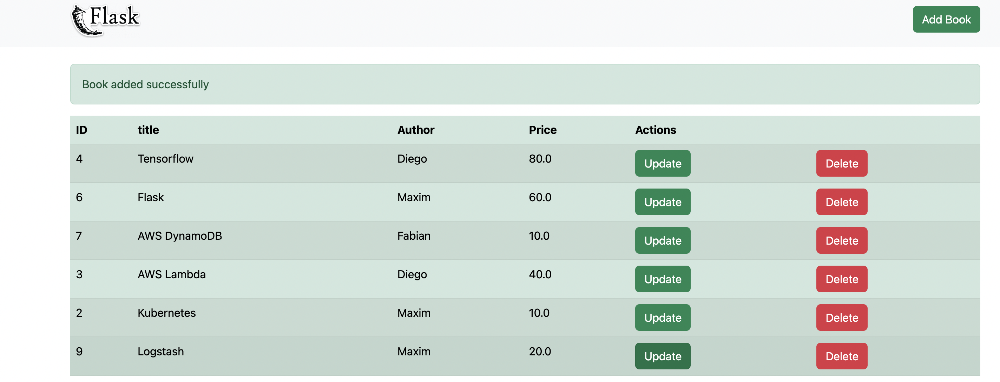
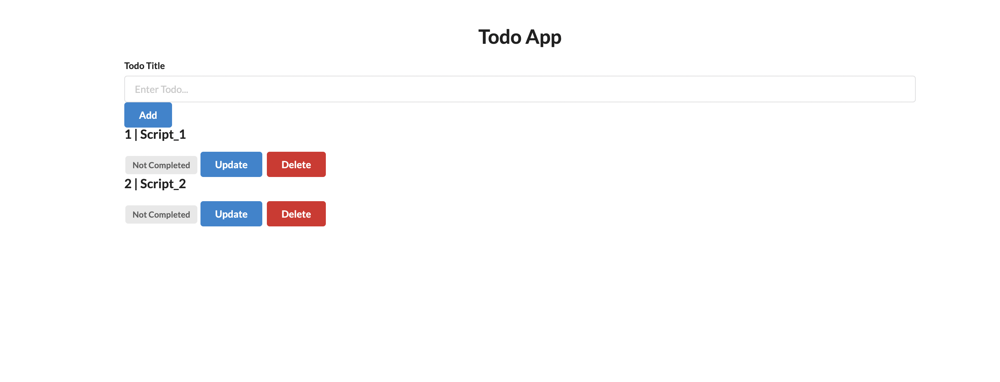

# FlaskOOP

Flask Form connects flask with postgresql using Object oriented format.

# FLASKAWS

Flask AWS connects flask with postgresql using Ordinary. But will still be changed to connect to AWS DynamoDB.

# ToDo_App

This a todo app, This uses SQLAlchemy and sqlite.

