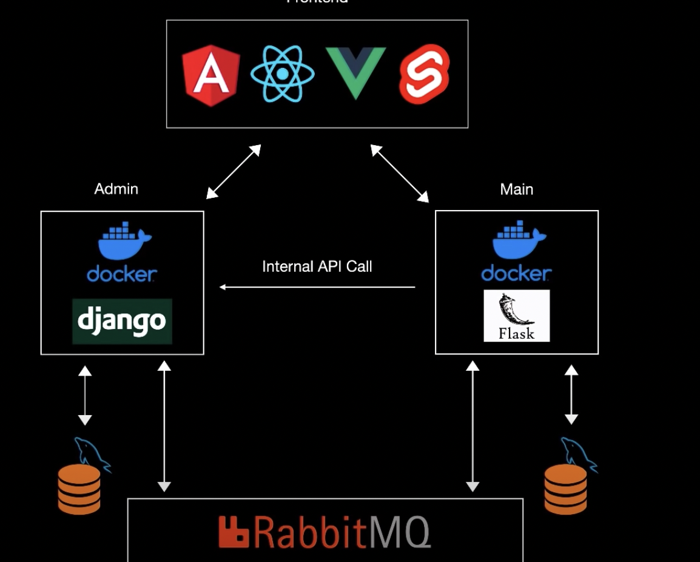
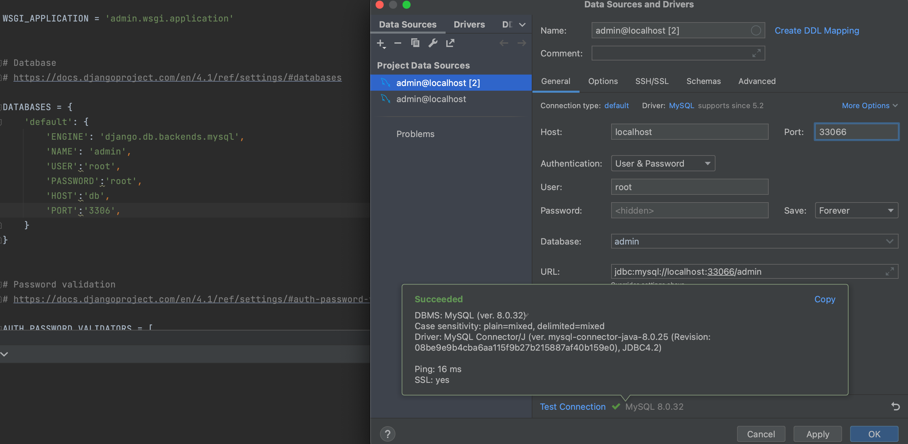

# Python Microservices
Admin app with Django, and main app use Flask, they will communicate using Rabbitmq.



# Django App

`django-cors-headers` is needed for frontend to access the backend.

`pika` useful when we will connect with rabbitmq.

0. Step0
Create an admin database in `mysqlworkbench`
Go to `admin/admin/settings.py` and update `ALLOWED_HOSTS = []` to `ALLOWED_HOSTS = ['0.0.0.0']` .

in Terminal:

```sh
/bin/zsh -l
source env/bin/activate
cd admin
docker-compose up
```

remember you are connecting to mysql client from container
check if admin database it already exist:

```shell
#show if database is setup
docker-compose exec db mysql -u root -p root -e "SHOW DATABASES;"
#1. Open your MySQL client
docker-compose exec db mysql -u root -p
#enter password, in this case root

#2. create a new database by running the following command:
CREATE DATABASE admin;
```

connect to this database admin via pycharm.
a complete explanation is below if error is encountered.


1. Step1

name of service is `backend`
```shell
docker-compose exec backend sh
```
`docker-compose exec backend sh` is a command used to run an interactive shell 
session in a Docker container named backend.

docker-compose is a command-line tool for defining and running multi-container Docker 
applications. exec is a subcommand of docker-compose used to execute a command in a 
running container.

In this case, the backend container is started with a Docker image that contains a 
Python application, and the sh command is used to start a shell session in the 
container. This allows you to interact with the container's file system and run 
commands as if you were working directly on the machine where the container is running.

2. Step2
```shell
python manage.py startapp products
```
in backend shell create `product` app 
by running  `python manage.py startapp products` is a command used in Django, 
a Python web framework, to create a new Django app named "products".

An app in Django is a self-contained module that encapsulates a specific functionality
of a web application. For example, a "products" app could handle all the functionality
related to products in an e-commerce website, such as displaying product details, 
adding products to cart, and handling payments.

The startapp command creates a new directory named "products" in the project directory
with a set of files and folders that are needed to define and configure the app. 
These files include an `__init__.py` file that makes the directory a Python package, a 
`models.py` file to define the database models, a `views.py` file to define the views, a 
`tests.py` file to write the tests for the app, and a `urls.py` file to define the URL routes 
for the app.

3. Step3

go to `admin/settings.py` Add products to 
```py
INSTALLED_APPS =[...,
    'rest_framework',
    'corsheaders',
    'products'
]

#add 'corsheaders.middleware.CorsMiddleware'
MIDDLEWARE = [
    'django.middleware.security.SecurityMiddleware',
    'django.contrib.sessions.middleware.SessionMiddleware',
    'corsheaders.middleware.CorsMiddleware',
    ...
]
#add this at the end
CORS_ORIGIN_ALLOW_ALL =True

#connect with mysql
```

in database change from this:
```python
DATABASES = {
    'default': {
        'ENGINE': 'django.db.backends.sqlite3',
        'NAME': BASE_DIR / 'db.sqlite3',
    }
}
```
To this:
```python
DATABASES = {
    'default': {
        'ENGINE': 'django.db.backends.mysql',
        'NAME': 'admin',
        'USER':'root',
        'PASSWORD':'root',
        'HOST':'db',
        'PORT':'3306',
        
    }
}
```
```shell
# restart ctrl+c
docker-compose up

```

4. Step4

in products.py
```python
from django.db import models
# Create your models here.
class Products(models.Model):
    title= models.CharField(max_length=200)
    image= models.CharField(max_length=200)
    likes= models.PositiveIntegerField(default=0)

```

Generate migrations, go to terminal, 
```sh 
docker-compose exec backend sh
python manage.py makemigrations

```
if error: `databse admin` is not found.

```shell
#check for containers running
docker-compose ps

#show if database is setup
docker-compose exec db mysql -uroot -proot -e "SHOW DATABASES;"
```

if database admin not there, You can open the MySQL client from the terminal using the 
following command:
```shell
#1. Open your MySQL client
docker-compose exec db mysql -u root -p
#enter password, in this case root

#2. create a new database by running the following command:
CREATE DATABASE admin;

#3. Create a new user with the username root and password root:
CREATE USER 'root'@'%' IDENTIFIED BY 'root';

#IF NO ERROR
 #3.1 Create a new user with the username root and password root:
CREATE USER 'root'@'%' IDENTIFIED BY 'root';
 #3.2 Grant all privileges to the user on the admin database:
GRANT ALL PRIVILEGES ON admin.* TO 'root'@'%';

 #3.3 Verify that the user has access to the admin database by connecting to the MySQL server with the following command:
#Enter the password here it is root when prompted
mysql -h localhost -u root -p

 #3.4. Once you're connected, switch to the admin database by running the following command:
USE admin
 
 #3.5 Create the necessary tables for your Django application by running the following command:
python manage.py migrate

#4.0 IF error check if root already existed
SELECT User FROM mysql.user;

#5.0 if so go to another terminal run
docker-compose exec backend sh
python manage.py makemigrations
python manage.py migrate

```

Create Views and urls routes for `products`,
Also include this part `path('api/', include('products.urls'))` to admin `urls` and 
import `include` and create a python file `products/serializers.py`.

Use postman to test apis
Methods defined in `views.py`
* list(self,request): get request `http://0.0.0.0:8000/api/products`
    * This returns what is in the product table, thus array of objects
    ```json
    [
        {
            "id": 1,
            "title": "title",
            "image": "image",
            "likes": 0
        }
    ]
    ```

* create(self,request): POST request: `http://0.0.0.0:8000/api/products`
  * Adds a row to the table:
  ```json
    {
    "title":"title",
    "image":"image"
    }
  ```
  Shows that it is added
    ```json
    [
        {
            "id": 1,
            "title": "title",
            "image": "image",
            "likes": 0
        }
    ]
    ```
* create(self,request): POST request: `http://0.0.0.0:8000/api/products`
* retrieve(self,request,pk=None): GET request:`http://0.0.0.0:8000/api/products/1`
    ```json
        {
            "id": 1,
            "title": "title",
            "image": "image",
            "likes": 0
        }
    ```
* update(self, request, pk=None): PUT request: `http://0.0.0.0:8000/api/products/1`
  * update the row with `id=1`:
  ```json
    {
    "title":"new title",
    "image":"new image"
    }
   ```
  shows the returned changed row
   ```json
     {
        "id": 1,
        "title": "new title",
        "image": "new image",
        "likes": 0
        }
   ```
   
* destroy(self, request, pk=None): DELETE request: `http://0.0.0.0:8000/api/products/1`
 This deletes an object, then go and get all object, this returns empty array if only item with id=1 
 is contained in the tables

## User

* Add user part in `urls.py` this is it: `path('user', UserAPIView.as_view())`
and add the imports `from .views import ProductViewSet,UserAPIView`
* Add user manually to the database, e.g 1,2,3,4,5 and submit changes
* use route `http://0.0.0.0:8000/api/user` to get users randomly


# Flask APP

To communicate with the user.
Create main directory,
Create `dockerfile and docker-compose.yml` file:
in `docker-compose.yml`:
* services=backend: 
  * flask uses port 5000 and 8001 thus `8001:5000`
  * `DB_NAME=main`
* services=db: ports: `33067:3306`


Running it, 
The port will not be 5000, because this will be inside docker container,
the port is 8001, run this `http://0.0.0.0:8001`

Run this to test the connection `http://0.0.0.0:8001` This works well.
Libraries used by the container:

**Note** This libraries are working fine
```shell
alembic==1.10.2
certifi==2022.12.7
charset-normalizer==3.1.0
click==8.1.3
Flask==2.2.3
Flask-Cors==3.0.10
Flask-Migrate==2.5.3
Flask-Script==2.0.5
Flask-SQLAlchemy==3.0.3
greenlet==2.0.2
idna==3.4
importlib-metadata==6.1.0
itsdangerous==2.1.2
Jinja2==3.1.2
Mako==1.2.4
MarkupSafe==2.1.2
mysqlclient==2.1.1
pika==1.3.1
requests==2.28.2
six==1.16.0
SQLAlchemy==2.0.7
typing_extensions==4.5.0
urllib3==1.26.15
Werkzeug==2.2.3
zipp==3.15.0
```

Write `main.py` file and create a migration by populating `manager.py`,
go to new terminal 
* `cd main` 
* run `docker-compose up`
* `.dbdata` directory is created
* run `docker-compose exec backend sh`
* check installed libraries in docker container `pip freeze -l`
* you are now inside docker container, run `python manager.py db --help`
* you see init is used for migration `python manager.py db init`
* migrations directory is created.

*Error with Flask Migrate*

New version of it `Flask-Migrate-4.0.4`
The MigrateCommand seems to be no longer supported: https://github.com/miguelgrinberg/Flask-Migrate/issues/407
```shell
Flask
Flask-SQLAlchemy
SQLAlchemy
Flask-Migrate==2.5.3
Flask-Script==2.0.5
Flask-Cors
requests
mysqlclient
pika
```
After this `python manager.py db init` create database:
  * `python manager.py db init`
* Then migrate them by running `docker-compose exec db mysql -u root -p`
* Enter password: `root`
* see if `main` database is created by running `SHOW DATABASES;`
* If not created `CREATE DATABASE main;`
* 
* `exit`
* run this again run `docker-compose exec backend sh` 
* run `python manager.py db migrate`


# References:

1. [Django Quickstart](https://www.django-rest-framework.org/tutorial/quickstart/)
2. [github source](https://github.com/scalablescripts/python-microservices)
3. [Error Flask-Migrate](https://stackoverflow.com/questions/68527489/cant-import-migratecommand-from-flask-migrate)
4. 