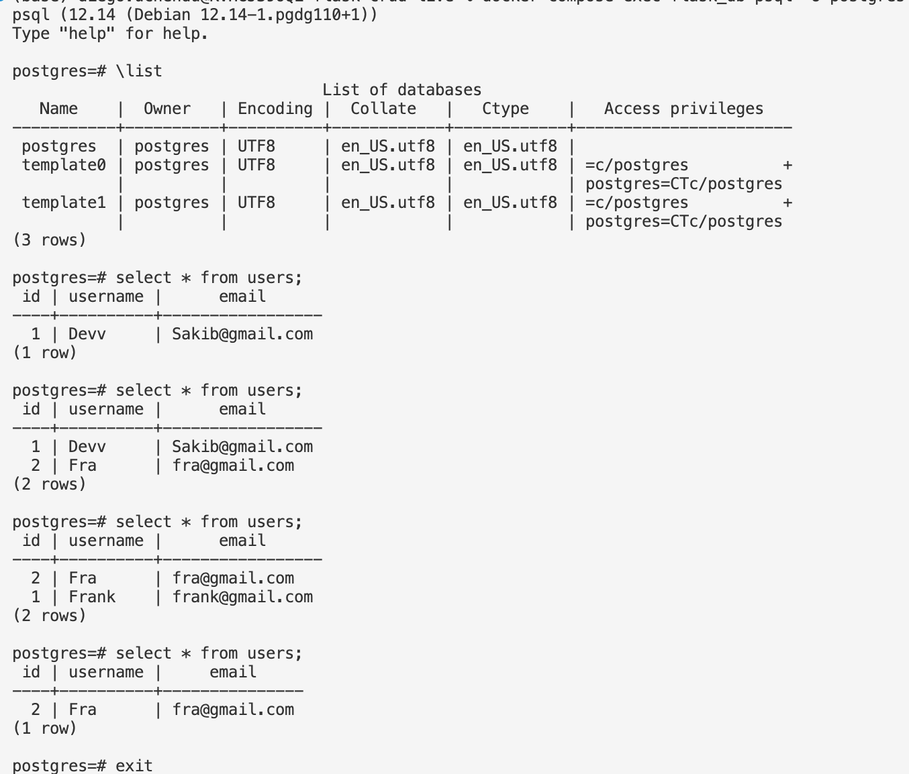

* Run postgres container `docker compose up -d flask_db` to pull docker image from docker hub and run it.
  * Initial error after running `docker-compose up flask_app`: 
  ```sh
    [+] Running 1/0
    ⠿ Container flask_app  Created                                                                                                 0.1s
    Attaching to flask_app
    Error response from daemon: Ports are not available: exposing port TCP 0.0.0.0:5432 -> 0.0.0.0:0: listen tcp 0.0.0.0:5432: bind: address already in use
  ```
  * To resolve this, delete image an container, and change `flask_db` ports:
  From
  ```yml
    ports:
      - "5432:5432"
  ```
  
  To
  ```yml
    ports:
      - "5433:5432"
  ```
* Build docker image around the docker container `docker-compose build`
* `docker-compose up flask_app` 
* Test it `http://localhost:4000/test` this works on chrome.
* Use Postman to test the routes:
  * Get `localhost:4000/users`
  * Post `localhost:4000/users`
  ```json
    {
    "username":"Devv",
    "email":"Sakib@gmail.com"
    }
  ```
  response:
  ```json
    {
    "message": "user created"
    }
  ```
  * Check the database: 
    * Enter Postgres `docker-compose exec flask_db psql -U postgres`
    * List databases: `\list`
    * Now see what is inside the database: `select * from users;`

  * GET: `localhost:4000/users/1` to get a user with id=1 `postman`  implemented here `get_user(id)`
  * PUT: `localhost:4000/users/1` implemented here: `update_user(id)` 
  * DELETE:`localhost:4000/users/1`   implemented here `delete_user(id)`: 
  ```json
    {
    "message": "user deleted"
    }
  ```

* Run: `docker-compose exec flask_db psql -U postgres`
